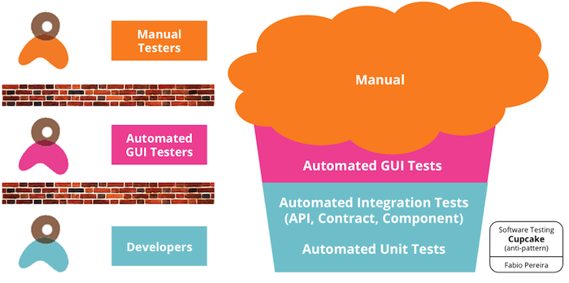
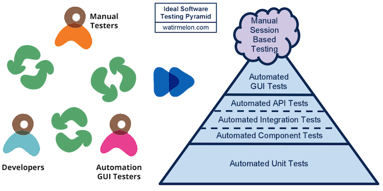
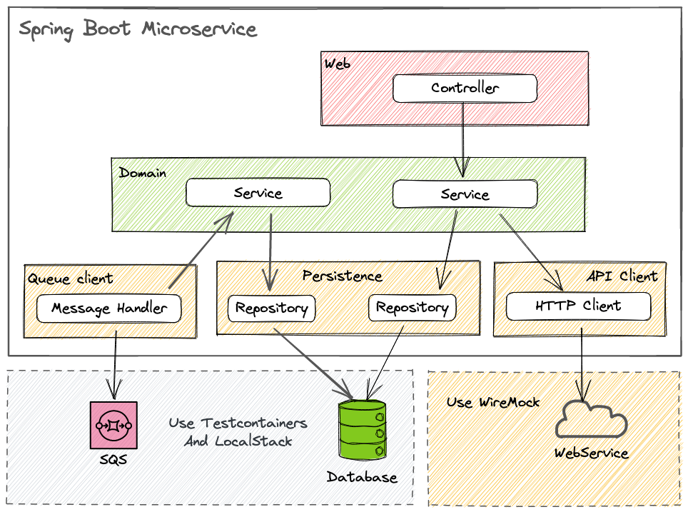
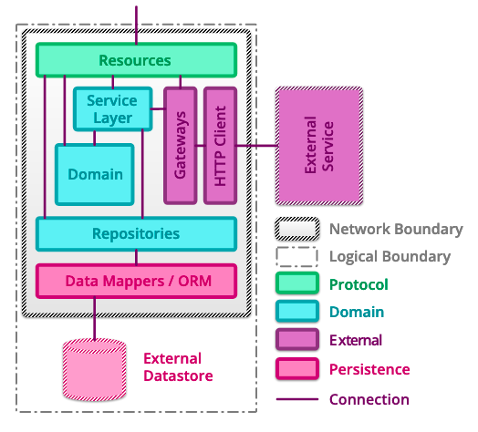
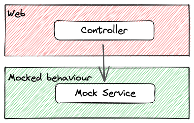
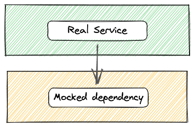
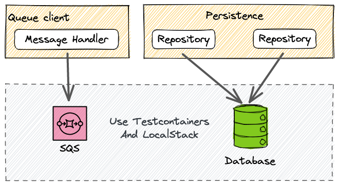
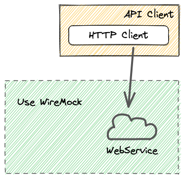

# Testing Microservices

<hr/>

## Agenda

* A classic layered architecture with Spring Boot
* REST Controllers
* Service Layer
* Persistence Layer
* HTTP API client layer

---

## Why this session?

<hr/>

### From Anti-Pattern



[Source for image](https://www.thoughtworks.com/en-de/insights/blog/introducing-software-testing-cupcake-anti-pattern)

---

## Why this session?

<hr/>

### To Best Practices



[Source for image](https://www.thoughtworks.com/en-de/insights/blog/introducing-software-testing-cupcake-anti-pattern)

---

## Layered Architecture

<hr/>



---

## Layered Architecture - detailed view

<hr/>



[Image source](https://martinfowler.com/articles/microservice-testing/#anatomy-connections)

---

## Why a Layered Approach in Testing?

<hr/>

### The Swiss Cheese Analogy


[Image source](https://blog.korny.info/2019-07-22-the-swiss-cheese-model-and-acceptance-tests/acceptance_tests.svg)

---

## General guidance

<hr/>

* No field injection
    * All fields should be injected via constructor
    * Makes it easy to contruct objects with mocks
    * Constructor field injection promotes immutability [Spring docs](https://docs.spring.io/spring-framework/docs/current/reference/html/core.html#beans-basics)
* Objects used in one layer should not be shared with other layers: REST, domain and persistence
* Mappers should be used to translate between layers (and should be unit tested!)
* Request objects should not be reused as response objects at the REST layer
* Fields should be final
* Keep the number of fields low (max 5), to avoid cognitive complexity

---

## REST Controllers

<hr/>

* Defined using annotation `@RestController`
* Contains annotations from several libraries for: 
  * Payload validation `@Valid`
  * Resource URL mapping `@GetMapping`
  * Ocasional Lombok's `@RequiredArgsConstructor`
  * Loggers `@Slf4j`
  * Security `@RolesAllowed`
  * etc.
* Responsibilities: 
  * Mapping incoming requests to handler methods
  * Perform payload validation at the edge of the microservice
  * Autowire dependencies: inject objects and fields

---

## A REST Controller

<hr/>

```java
@RestController
@RequestMapping("/api/v1/rooms")
public class RoomsController {

    private final GetRoomsUseCase getRoomsUseCase;

    public RoomsController(final GetRoomsUseCase getRoomsUseCase) {
        this.getRoomsUseCase = getRoomsUseCase;
    }

    @GetMapping
    @ResponseBody
    @RolesAllowed({"rooms:read"})
    public List<RoomResponse> getRooms() {
        return getRoomsUseCase.execute().stream().map(RoomToRoomResponse::map).toList();
    }
}
```

---

## REST Controller quick view

<hr/>

### Should test

* Authorization
* Payload for request/response
* Handling of most common error cases: 400, 401, 403, 500
* Expected methods are called on services
* Mappings between web layer and service layer objects



---

## Testing REST Controllers

<hr/>

Spring Boot gives us the [`@WebMvcTest`](https://docs.spring.io/spring-boot/docs/current/api/org/springframework/boot/test/autoconfigure/web/servlet/WebMvcTest.html) annotation that will:

* Disable auto-configuration
* Configure only relevant components (no `@Component, @Service or @Repository` beans)
* Will configure Spring Security and MockMvc
* Allows for mocking beans needed for running the tests
* Allows for testing correct mapping for allowed roles
* Allows for testing for error codes on invalid authentication/authorization scenarios
* Works out of the box with JUnit 5

### Advantages:

* A light-weight configuration compared to `@SpringBootTest`
* Focuses only on testing the _Controller_ layer

---

## Example using `@WebMvcTest` - 1

<hr/>

```java
@WebMvcTest(RoomsController.class)
class RoomsControllerIT {

    @Autowired
    private MockMvc mockMvc;

    @MockBean
    private GetRoomsUseCase getRoomsUseCase;

    @Test
    @WithMockUser(authorities = {"rooms:read"})
    void should_Get_AllRooms() throws Exception {
        // arrange
        final Room room = Room.builder().name("Some name").build();
        when(getRoomsUseCase.execute()).thenReturn(Collections.singletonList(room));

        // act, assert
        this.mockMvc.perform(get("/api/v1/rooms"))
                .andDo(print())
                .andExpect(status().isOk())
                .andExpect(content().json("[{\"name\":\"Some name\"}]"));
    }

}
```

---

## Example using `@WebMvcTest` - 2

<hr/>

```java
@WebMvcTest(RoomsController.class)
class RoomsControllerIT {

    @Autowired
    private MockMvc mockMvc;

    @MockBean
    private GetRoomsUseCase getRoomsUseCase;

    @Test
    void should_Return401_When_MissingRoles() throws Exception {
        // arrange, act, assert
        this.mockMvc.perform(get("/api/v1/rooms"))
                .andDo(print())
                .andExpect(status().isUnauthorized());

        verifyNoInteractions(getRoomsUseCase);
    }
}
```

---

## Service Layer

<hr/>

Testing at the service layer shouldn't require any special annotations, these should be unit tests that are mocking any dependencies.

Example service:

```java
@Component
public class GetRoomsUseCaseImpl implements GetRoomsUseCase {

    private final RoomsRepository roomsRepository;

    public GetRoomsUseCaseImpl(final RoomsRepository roomsRepository) {
        this.roomsRepository = roomsRepository;
    }

    @Override
    public List<Room> execute() {
        return roomsRepository.findAll().stream()
                .map(RoomEntityToRoom::map)
                .filter(Optional::isPresent)
                .map(Optional::get)
                .toList();
    }
}
```

---

## Service layer quick view

<hr/>

### Should test

* Logic inside services
* Mappings between service layer and downstream layers: repository, messaging etc.
* Expected methods are called on downstream layers



---

## Example Service Test

<hr/>

```java
class GetRoomsUseCaseTest {
    private GetRoomsUseCase sut;
    private final RoomsRepository repository = Mockito.mock(RoomsRepository.class);
    
    @BeforeEach
    void setup() {
        sut = new GetRoomsUseCaseImpl(repository);
    }

    @Test
    void shouldReturnRoomsWhenAvailable() {
        // arrange
        final RoomEntity entity = RoomEntity.builder().id(UUID.randomUUID()).build();
        final Room expected = RoomEntityToRoom.map(entity).get();
        when(repository.findAll()).thenReturn(Collections.singletonList(entity));

        // act
        final List<Room> rooms = sut.execute();

        // assert
        assertThat(rooms).isNotNull().isNotEmpty().containsExactly(expected);
    }
}
```

---

## Persistence Layer

<hr/>

The persistence layer can connect to different databases, for this example, I am using PostGresQL.

Example of a Repository:

```java
@Repository
public interface RoomsRepository extends JpaRepository<RoomEntity, UUID> {
}
```

---

## Persistence layer quick view

<hr/>

### Should test

* Any custom logic (custom queries)
* Connectivity between repository and the database
* Should not test default JPA queries, they are all tested already



---

## Persistence Test - setup

<hr/>

```java
@DataJpaTest
@Testcontainers
class RoomsRepositoryIT {

    @Container
    static final PostgreSQLContainer<?> postgres = new PostgreSQLContainer<>("postgres:14-alpine3.15")
            .withReuse(true);

    @DynamicPropertySource
    static void setProperties(DynamicPropertyRegistry registry) {
        registry.add("spring.datasource.username", postgres::getUsername);
        registry.add("spring.datasource.password", postgres::getPassword);
        registry.add("spring.datasource.url", postgres::getJdbcUrl);
    }

    @Autowired
    private RoomsRepository roomsRepository;

    @BeforeEach
    void setup() {
        assertThat(roomsRepository).isNotNull();
        this.roomsRepository.deleteAll();
    }
}
```

---

## Persistence Layer Test - 1

<hr/>

```java
@DataJpaTest
@Testcontainers
class RoomsRepositoryIT {

    // setup was done earlier due to space issue

    @Test
    void shouldConnectToTheDatabase() {
        // arrange
        final RoomEntity entity = RoomEntity.builder().build();
        assertThat(entity.getId()).isNull();

        // act
        RoomEntity saved = roomsRepository.save(entity);

        // assert
        assertThat(saved.getId())
                .isNotNull()
                .isInstanceOf(UUID.class);
    }
}
```

---

## Persistence Layer Test - 2

<hr/>

* The purpose of this test is to make sure that our repository will perform an interaction with a database, when connected to one
* Out of scope are testing all the methods that the repository exposes, they have been tested already in the framework
* We should test any custom logic that we are building
* Setup using [TestContainers](https://www.testcontainers.org/)
* Autowire only the repository
* Replace DB connection details with the ones from the Docker container
* Make sure that the repository is instantiated
* Test that the persisted object will receive an ID from the DB (confirmation that persistence was OK)

---

## Object mappers

<hr/>

When translating from one object to another, there's a good practice for having object mappers. Main characteristics:

* Static final classes with static methods
* Keeps any validation for the target object in one place
* Easy to unit test

---

## Example of an object mapper

<hr/>

```java
public final class RoomEntityToRoom {

    private RoomEntityToRoom() {
        // nothing to see here
    }

    public static Room map(final RoomEntity entity) {
        return Optional.ofNullable(entity)
                .map(source -> Room.builder()
                        .name(source.getName())
                        .build())
                .orElseThrow(() -> new NullPointerException("Source object cannot be null"));
    }
}
```

---

## Testing an object mapper

<hr/>

```java
class RoomEntityToRoomTest {

    @Test
    void shouldMapAllFields() {
        // arrange
        final RoomEntity entity = RoomEntity.builder()
                .id(UUID.randomUUID())
                .name("Some name")
                .build();
        final Room expected = Room.builder()
                .name("Some name")
                .build();
        // act
        final Optional<Room> actual = RoomEntityToRoom.map(entity);

        // assert
        assertThat(actual)
                .isNotNull()
                .isPresent()
                .get()
                .usingRecursiveComparison().isEqualTo(expected);
    }
}
```

---

## Testing a HTTP Client

<hr/>

* Calling downstream services via HTTP might require wrapping the API into some sort of client
* When calling external services, it requires to use a retry strategy and a circuit breaker (at least)
* The configuration for the circuit breaker and retries require some annotation magic
* While a unit test might be enough to test the client, it requires the application context for the annotations to work
* The following example uses [Resilience4J](https://resilience4j.readme.io/docs) to configure a client
* This is heavier test than usual, I haven't found a way to avoid wiring (mostly) the entire application 

---

## Http client quick view

<hr/>

### Should test

* Mapping between the internal request objects and expected payload
* Mapping between the response payload and internal objects
* Handling of error cases: 400, 401, 403, 500 etc.
* That the circuit breaker, retries etc. are picking-up configuration



---

## Example of a HTTP Client

<hr/>

* [HttpClientImpl.java](https://github.com/georgeracu/spring-boot-demo-app/blob/main/src/main/java/com/georgeracu/demo/springboot/adapter/out/HttpClientImpl.java)
* [HttpClientImplTest](https://github.com/georgeracu/spring-boot-demo-app/blob/main/src/test/java/com/georgeracu/demo/springboot/adapter/out/HttpClientImplTest.java)
* [Resilience4J configuration](https://github.com/georgeracu/spring-boot-demo-app/blob/main/src/main/resources/application.yaml)

---

## Testing pyramid

<hr/>

To do: 
* show the testing pyramid with the current tests at each layer: many unit tests at the botttom and fewer tests as we go up
* write an integration test for testing the happy path and show how everything is wired together and working
* show that edge cases, exceptions, anything than the happy path are tested with unit tests, in their layer, and not tested as integration tests because: slow, hard to setup, not actually testing integration of components.
* Integration testing is actually testing happy paths and making sure that they work as expected

---

## Questions?

<hr/>

### Thank You :-)
